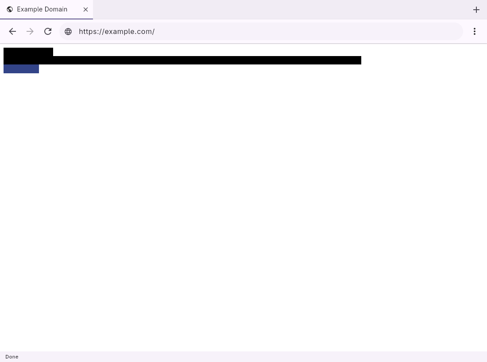

# Vixen

[](https://github.com/adonm/vixen/actions/workflows/ci.yml)
[](https://github.com/adonm/vixen/actions/workflows/pages.yml)
[](https://vixen.adonm.dev/)
[](https://github.com/adonm/vixen/blob/main/LICENSE)
[](https://github.com/adonm/vixen/blob/main/Cargo.toml)
[](FLUTTER_SHELL.md)

Vixen is a focused cross-platform Firefox replacement: a Flutter GUI targeting
Linux, macOS, Windows, Android, and the Apple Silicon iOS Simulator, first-class headless/CDP automation, and
the most web capability per byte.

The hard, spec-heavy subsystems are delegated where that keeps Vixen smaller
and more correct: **Stylo/selectors** for CSS matching and cascade,
**deno_core/V8** for JS execution and host packaging, **WebRender** for paint,
and **html5ever** for HTML. BrowserCore owns browser truth and Flutter/Dart owns
only chrome, presentation, and host-service UI. The Linux Flutter shell has a
real BrowserCore bridge, bounded RGBA texture, and a tested release archive;
Flutter is the sole rendered GUI; host services, complete accessibility, and
basic-browser parity remain open.

## Linux release

Tagged releases publish the official x86_64 Flutter bundle:

```sh
curl -LO https://github.com/adonm/vixen/releases/latest/download/vixen-linux-x86_64.tar.gz
tar -xzf vixen-linux-x86_64.tar.gz
./vixen/vixen_shell
```

FlatPark repackages this unchanged release archive as a signed convenience
Flatpak. The package remains unavailable until its registry submission is
accepted, and submission/publishing is intentionally deferred until the Linux
Flutter shell passes the basic-browser usability gate. Neither form implies
parity with the remaining platform targets.



## Start here

- [Project Direction](PROJECT_DIRECTION.md) — current focus and constraints.
- [Architecture](ARCHITECTURE.md) — crate layout and dependency direction.
- [Flutter Shell](FLUTTER_SHELL.md) — five-platform GUI contract and gates.
- [Roadmap](ROADMAP.md) and [Milestones](MILESTONES.md) — current delivery and evidence.
- [Historical Plan](PLAN.md) — original Linux/Relm4 phase record.
- [Development](DEVELOPMENT.md) — local workflow and contribution mechanics.
- [Linux release and FlatPark](guidance/flatpark-release.md) — the official
  release archive and community Flatpak path.

## Repository

- Source: <https://github.com/adonm/vixen>
- Releases: <https://github.com/adonm/vixen/releases>
- Docs: <https://vixen.adonm.dev/>
- FlatPark: <https://flatpark.org/>
